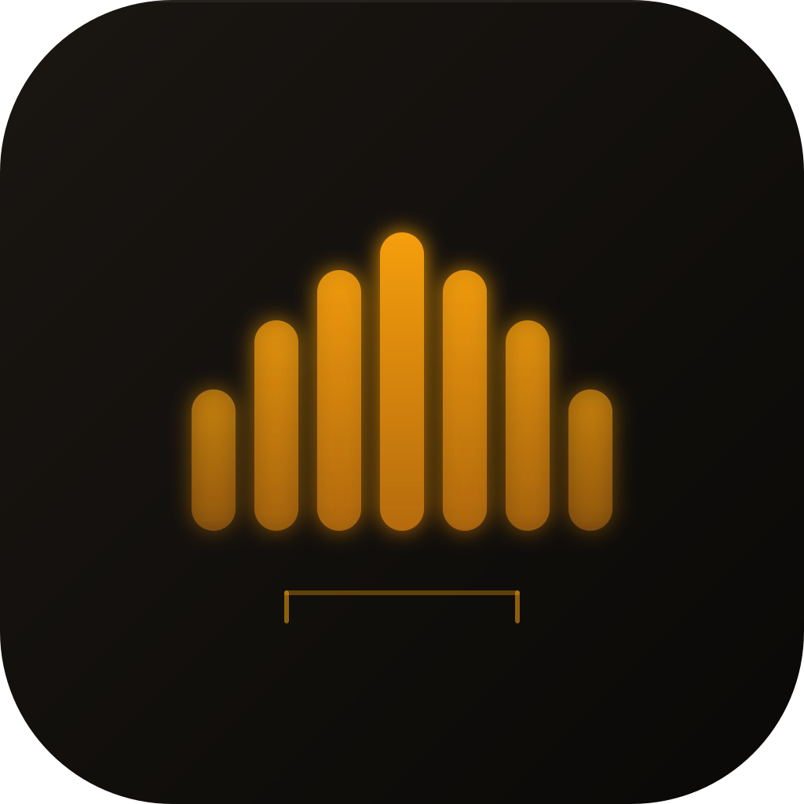
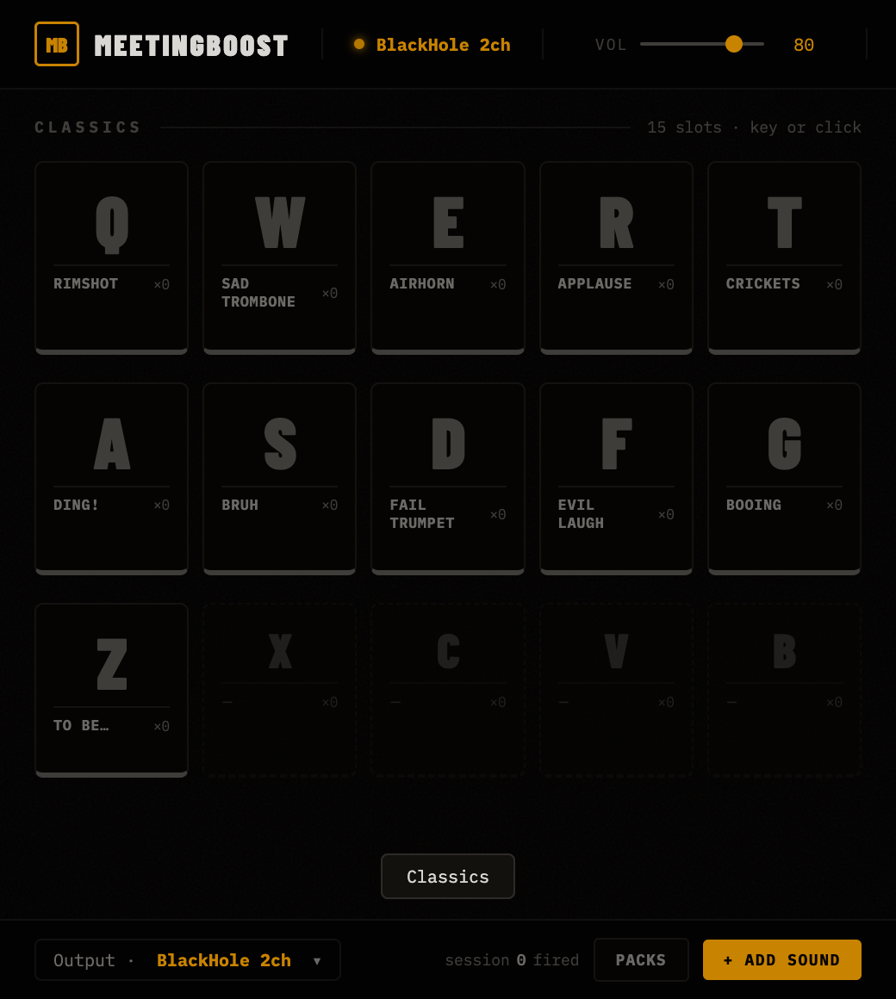
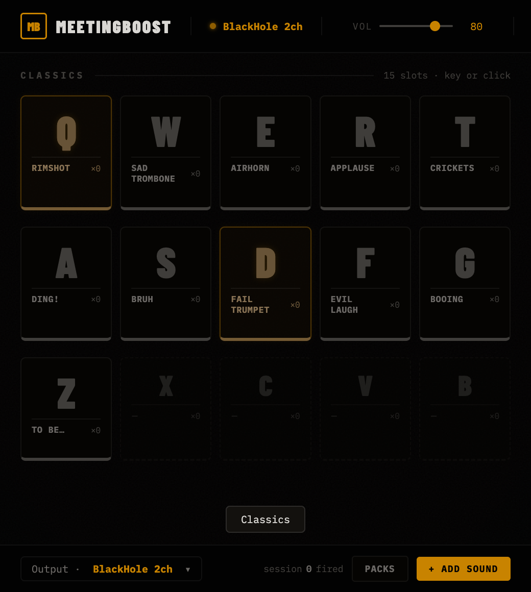
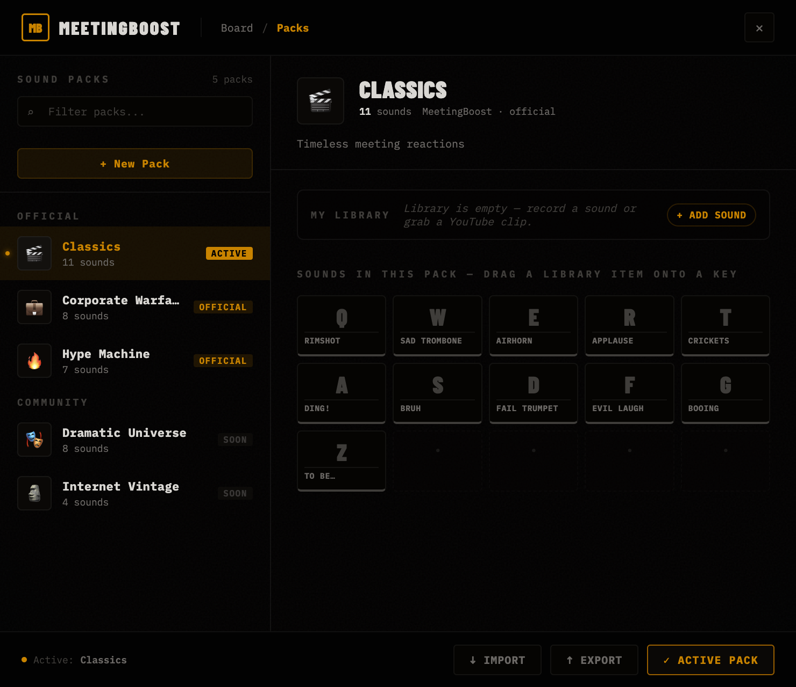
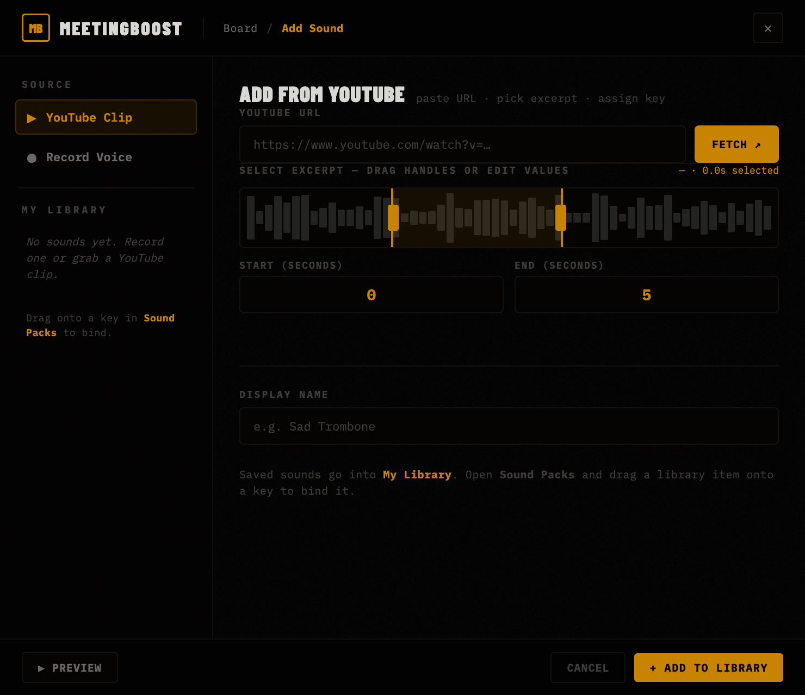
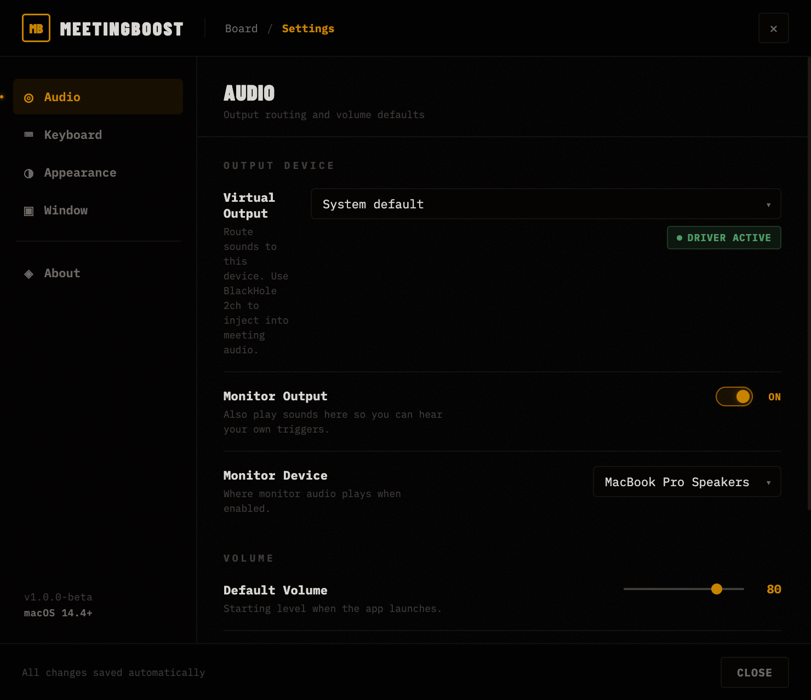

<p align="center">
  
</p>

<h1 align="center">MeetingBoost</h1>

<p align="center">
  <strong>A keyboard-driven soundboard for macOS meetings.</strong><br>
  Press <kbd>Q</kbd> for a rimshot. Press <kbd>W</kbd> for a sad trombone. Win the call.
</p>

<p align="center">
  <a href="https://github.com/extrainio/meetingboost/actions/workflows/ci.yml">
    
  </a>
  <a href="https://github.com/extrainio/meetingboost/actions/workflows/release-macos.yml">
    
  </a>
  <a href="https://github.com/extrainio/meetingboost/releases/latest">
    
  </a>
  <a href="LICENSE">
    
  </a>
  
  
  
</p>

<p align="center">
  <a href="https://github.com/extrain-pascal/meetingboost/releases/latest"><strong>↓ Download for macOS</strong></a> ·
  <a href="https://extrainio.github.io/meetingboost/">Website</a> ·
  <a href="#quick-start">Quick start</a> ·
  <a href="#showcase">Showcase</a> ·
  <a href="#features">Features</a> ·
  <a href="#mbpack-format">.mbpack format</a> ·
  <a href="CONTRIBUTING.md">Contributing</a> ·
  <a href="SHIPPING.md">Roadmap</a>
</p>

---

## Showcase

<table>
  <tr>
    <td align="center" width="50%">
      
      <br /><sub><strong>The board</strong> — always-on-top, 520×580, your keyboard is the trigger surface.</sub>
    </td>
    <td align="center" width="50%">
      
      <br /><sub><strong>Lit state</strong> — amber glow on press, keycap collapses 3px like a real key.</sub>
    </td>
  </tr>
  <tr>
    <td align="center">
      
      <br /><sub><strong>Packs</strong> — 3 official packs, plus your custom + community packs.</sub>
    </td>
    <td align="center">
      
      <br /><sub><strong>Add Sound</strong> — YouTube clip → key, voice record, or import.</sub>
    </td>
  </tr>
  <tr>
    <td align="center" colspan="2">
      
      <br /><sub><strong>Settings</strong> — virtual output, monitor device, theme, keyboard, window opacity.</sub>
    </td>
  </tr>
</table>

---

## What is it?

MeetingBoost is a tiny, always-on-top window that turns your keyboard into a
soundboard. Each letter key is a sound; tap one and it fires through your
audio output — straight into the meeting, if you've routed it through
a virtual driver like [BlackHole](https://existential.audio/blackhole/).

It ships with 26 free, royalty-free sound effects across three packs
(Classics, Corporate Warfare, Hype Machine), and gives you three ways to add
your own:

1. **Record your voice** with the built-in mic capture.
2. **Clip a YouTube video** directly to a key with start/end trim.
3. **Import a `.mbpack`** that someone else exported and shared.

It's built with Electron + TypeScript, has no telemetry, and weighs in at
under 200 lines of TypeScript on the main side.

---

## Features

- **One key, one sound.** No menus, no dragging, no clicking. The whole
  alphabet is your trigger surface.
- **Three curated sound packs** out of the box: Classics (rimshot, airhorn,
  sad trombone, applause...), Corporate Warfare (incoming meeting,
  notification, alert...), Hype Machine (vine boom, stinger, win...).
- **Voice recording** — built-in mic capture with live level meter, 30 s
  cap, and one-tap re-record. Saves directly to your Custom pack.
- **YouTube clip → key.** Paste a URL, scrub to a 1–10 s excerpt, assign
  it to a key. `yt-dlp` downloads, `ffmpeg` crops, you press the key.
- **YouTube Pack import.** Paste a YouTube URL into Sound Manager → "YouTube Pack" tab.
  The app detects chapter timestamps (single videos) or playlist entries, lets you review
  and uncheck candidates, and creates a ready-to-use pack mapped to the keyboard layout
  (`q,w,e,r,t / a,s,d,f,g / z,x,c,v,b`). Snippets >30 s are auto-unchecked; the cap is
  15 keys per pack. Requires `yt-dlp` on PATH (same as the YouTube Clip feature).
- **`.mbpack` export & import.** Share packs as single files. Auto-renames
  on collision so importing doesn't clobber your stuff.
- **Global keyboard capture.** With Accessibility permission granted,
  letter keys fire sounds even when MeetingBoost isn't the focused app.
- **Pick any audio output.** Real device enumeration via `setSinkId()` —
  route to BlackHole, AirPods, an external interface, anywhere.
- **Theme switching** — Dark, Light, or follow the system. Anti-FOUC inline
  loader, OKLCH color tokens, IBM Plex Mono throughout.
- **Always-on-top, draggable, tray-resident.** Press <kbd>⌥⇧M</kbd> from
  anywhere to show/hide. Native macOS template tray icon.
- **First-run onboarding** explains BlackHole and Accessibility setup.
- **No telemetry, no account, no cloud.** All settings live in
  `~/Library/Application Support/MeetingBoost/settings.json`.

---

## Quick start

If you just want to run it from source on macOS:

```bash
# 1. Prerequisites
brew install node@20 ffmpeg yt-dlp

# 2. Clone and install
git clone https://github.com/extrainio/meetingboost.git meetingboost && cd meetingboost
npm install

# 3. Get the sound files (free, ~10 MB)
make sounds

# 4. Launch
make dev
```

That's it. The board appears in the upper-left of your primary screen.
Click it to focus, then start mashing keys.

---

## Prerequisites

| Tool       | Version  | Why                                    | Install                  |
|------------|----------|----------------------------------------|--------------------------|
| **macOS**  | 13.0+    | Electron 32 minimum                    | already there            |
| **Node**   | 20+      | TypeScript build + Electron runtime    | `brew install node@20`   |
| **Python** | 3.11+    | Sound downloader + test suite          | shipped with macOS       |
| **ffmpeg** | 6+       | Cropping YouTube + transcoding voice   | `brew install ffmpeg`    |
| **yt-dlp** | recent   | Downloading YouTube audio              | `brew install yt-dlp`    |
| **zip / unzip** | any | Pack export / import (`.mbpack`)       | already there            |

Everything except Node and macOS is **optional** — but missing them disables
the corresponding feature with a clear in-app error.

For the soundboard to actually inject audio into a video call, install
[BlackHole 2ch](https://existential.audio/blackhole/) and route the
meeting's microphone input through it. (Wiring this from inside MeetingBoost
is on the [roadmap](SHIPPING.md).)

---

## Usage

### Firing sounds

The board shows a 4×7 grid of keys (the full alphabet plus a few). Each
key shows the name of the sound bound to it; empty tiles are unassigned.

| Action                     | How                                               |
|---------------------------- |--------------------------------------------------|
| Fire a sound                | Press the matching letter while the board is focused |
| Toggle the board            | <kbd>⌥</kbd>+<kbd>⇧</kbd>+<kbd>M</kbd>            |
| Adjust volume               | Slider in the top-right of the nav                |
| Open Packs / Add Sound      | Click the icons in the nav                        |

### Switching packs

Click the pack icon in the nav (or open from the tray). The Packs screen
shows all installed packs in the left list, with a preview grid of their
sounds on the right. Click **Load Pack** to make it active. The board
re-skins instantly.

### Adding sounds

Open **Add Sound** from the nav. There are three sources:

#### Record Voice

1. Click the mic button.
2. macOS will prompt for microphone access (the first time only).
3. Speak — you'll see a live frequency-bin level meter.
4. Click again to stop. Up to 30 seconds.
5. Listen back, give it a name, pick a key, hit **Add to Board**.

The recording is saved as MP3 in `src/sounds/custom/`, and the Custom
pack is created automatically if it didn't exist.

#### YouTube Clip

1. Paste a YouTube URL and click **Fetch**.
2. The video info loads (title, channel, thumbnail).
3. Set start/end times (e.g., `0:01.5` and `0:04.0` — `mm:ss.s` or plain
   seconds).
4. Name it, pick a key, hit **Add to Board**.

`yt-dlp` downloads the audio in the background, `ffmpeg` crops to your
range, and the file lands in `src/sounds/custom/`.

#### Import .mbpack

See the [pack-sharing section](#mbpack-format) below.

### Themes

Settings → Appearance → pick **Dark**, **Light**, or **System**. Live
broadcast: any open windows update instantly.

---

## .mbpack format

`.mbpack` is the MeetingBoost pack-sharing format. It's a regular zip
file with a custom extension and a fixed layout:

```
my-pack.mbpack
├── manifest.json
└── sounds/
    ├── airhorn.mp3
    ├── rimshot.mp3
    └── …
```

`manifest.json` shape:

```json
{
  "mbpackVersion": 1,
  "id":            "classics",
  "name":          "Classics",
  "description":   "Timeless meeting reactions",
  "keys": {
    "q": { "label": "Rimshot",      "file": "sounds/rimshot.mp3" },
    "w": { "label": "Sad Trombone", "file": "sounds/sad-trombone.mp3" }
  },
  "exportedAt": "2026-05-01T12:00:00.000Z"
}
```

### Exporting

Open the Packs screen, select a pack, click **↑ Export** in the footer.
You'll get a save dialog and an `.mbpack` ready to ship.

### Importing

Open the Packs screen, click **↓ Import** in the footer. If the imported
pack id collides with one you already have, MeetingBoost auto-suffixes
it (`my-pack` → `my-pack-2`) so nothing gets clobbered.

### A real example

Drop this on Import to see it work:

```
assets/classics.mbpack    (2.6 MB · 11 sounds)
```

It's a real, importable archive, regenerated from the live classics pack
on every commit. Rebuild it any time with:

```bash
make example-pack
```

---

## Building & distribution

```bash
make build          # tsc → main.js, preload.js
make app            # build an unsigned .app for local testing  (~30 s)
make dmg            # build a .dmg installer (universal: arm64 + x64)
```

For shipping a signed/notarised DMG, you'll need an Apple Developer ID
certificate — see [SHIPPING.md](SHIPPING.md) for the full release
checklist.

The GitHub Actions workflow (`.github/workflows/ci.yml`) runs all unit
tests on every push and produces a DMG release on tags matching `v*`.

---

## Development

### Project layout

```
.
├── main.ts                    # Electron main process (windows, IPC, tray)
├── preload.ts                 # contextBridge surface exposed to renderers
├── src/
│   ├── board.html             # The soundboard window
│   ├── packs.html             # Pack browser / import / export
│   ├── sound-manager.html     # Add Sound (Record / YouTube / Upload / Preset)
│   ├── settings.html          # Settings (Audio / Keyboard / Appearance / Window)
│   ├── packs.json             # Source of truth for all pack data
│   └── sounds/                # The MP3 files, grouped by pack id
├── assets/
│   ├── logo.svg               # The app mark
│   └── classics.mbpack        # A real, importable example pack
├── scripts/
│   ├── download_sounds.py     # Bulk-download the curated sound packs
│   └── build_example_mbpack.py# Rebuild assets/classics.mbpack
├── tests/
│   ├── test_sounds.py         # Pack manifest + MP3 integrity (13 tests)
│   ├── test_pack_format.py    # .mbpack zip layout + manifest shape (7 tests)
│   ├── test_record_pipeline.py# WebM → MP3 ffmpeg integration (3 tests)
│   ├── test_youtube_download.py
│   └── e2e/                   # Playwright E2E specs (Electron-on-CI)
├── Makefile
├── package.json               # Electron + electron-builder config
└── SHIPPING.md                # Release & launch checklist
```

### Make targets

| Target              | What it does                                                     |
|----------------------|------------------------------------------------------------------|
| `make install`       | `npm install`                                                    |
| `make build`         | TypeScript compile                                               |
| `make dev`           | Build + launch with DevTools (`ELECTRON_IS_DEV=1`)                |
| `make test`          | Sound-pack integrity + TypeScript check                           |
| `make test-e2e`      | Playwright E2E suite (requires the app to launch)                |
| `make sounds`        | Download all sound packs (Pixabay + YouTube)                      |
| `make example-pack`  | Rebuild `assets/classics.mbpack`                                  |
| `make icon`          | `assets/icon.png` → `assets/icon.icns` (macOS bundle icon)         |
| `make icon-from-svg` | `assets/logo.svg` → PNG → ICNS in one step                        |
| `make app`           | Unpacked `.app` for smoke-testing                                 |
| `make dmg`           | `.dmg` installer (arm64 + x64)                                    |
| `make dist`          | Full release: `.dmg` + `.zip` for both architectures              |
| `make clean`         | Remove compiled JS and `release/`                                 |

### npm scripts

```bash
npm run dev          # tsc && ELECTRON_IS_DEV=1 electron .
npm run build        # tsc
npm run start        # tsc && electron .
npm run test         # python3 -m pytest tests/test_sounds.py
npm run test:e2e     # tsc && npx playwright test
npm run dist:dmg     # build the macOS DMG
```

### Tests

36 unit/integration tests across 4 files. The fast ones run on every push;
the slow ones (real YouTube downloads, Playwright E2E) are opt-in:

| File                              | Coverage                                        | Count | In CI |
|------------------------------------|------------------------------------------------|------:|:-----:|
| `tests/test_sounds.py`             | Pack manifest, MP3 integrity, tsc compiles      | 13    |  yes  |
| `tests/test_pack_format.py`        | `.mbpack` build + import round-trip             | 7     |  yes  |
| `tests/test_record_pipeline.py`    | WebM/Opus → MP3 via the exact `ffmpeg` call     | 3     |  yes  |
| `tests/test_youtube_download.py`   | yt-dlp + ffmpeg crop integration                | 13    | unit only |
| `tests/e2e/pack-selection.spec.ts` | Playwright Electron smoke (full IPC chain)      | —     |  no   |

Run them all:

```bash
make test                                  # fast unit tests
python3 -m pytest tests/test_record_pipeline.py -v      # ffmpeg pipeline
python3 -m pytest tests/test_pack_format.py -v          # .mbpack format
python3 -m pytest tests/test_youtube_download.py -v     # yt-dlp pipeline (slow)
```

### Architecture in 30 seconds

- **Main process** (`main.ts`): Electron window/tray management, JSON-on-disk
  settings store, all IPC handlers (`yt-info`, `yt-download`, `record-save`,
  `pack-export`, `pack-import`, `select-pack`).
- **Preload** (`preload.ts`): tiny `contextBridge` surface — only the
  functions renderers actually need. Renderers cannot reach Node directly.
- **Renderer pages** (`src/*.html`): each is a self-contained HTML/CSS/JS
  document. They share the same OKLCH design tokens and use no framework.
- **Pack data** (`src/packs.json`): a single JSON array — `{id, name,
  description, keys: {<letter>: {label, file}}}`. Every renderer fetches
  this directly. The Custom pack is created on first save.

External tooling is invoked via `child_process.spawn`:
`yt-dlp`, `ffmpeg`, system `zip`/`unzip`. No JS dependencies for any of
those concerns.

---

## Roadmap

The only thing still blocking a properly distributable v1:

- **Apple Developer code-signing + notarisation** so the DMG installs
  without Gatekeeper warnings. Hardened runtime, entitlements, and the CI
  release pipeline are already in place — only the cert is missing.

Already done (and mentioned earlier in this README): real global keyboard
capture, audio device routing with `setSinkId`, first-run onboarding.

See [SHIPPING.md](SHIPPING.md) for the full punch list with severity tiers
and a suggested ordering.

---

## Acknowledgements

- All shipped sounds are from [Pixabay](https://pixabay.com/sound-effects/)
  under their royalty-free license, plus one short public-domain YouTube
  clip. Run `python3 scripts/download_sounds.py` to fetch them.
- Built with [Electron](https://www.electronjs.org/),
  [yt-dlp](https://github.com/yt-dlp/yt-dlp),
  [ffmpeg](https://ffmpeg.org/), and a non-trivial amount of OKLCH.

---

## License

MIT — see [LICENSE](LICENSE). Use it, fork it, ship it. Just please don't
release a clone called MeetingBust.
